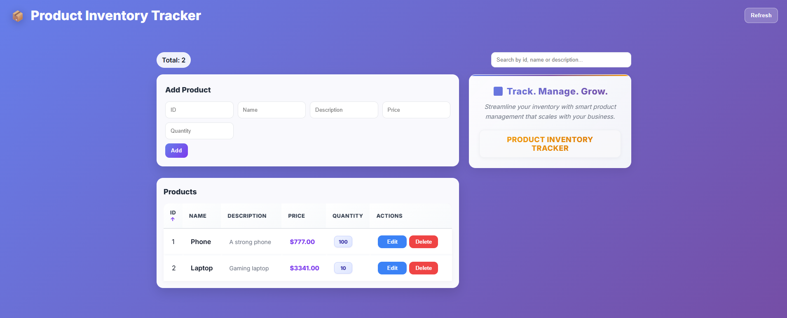
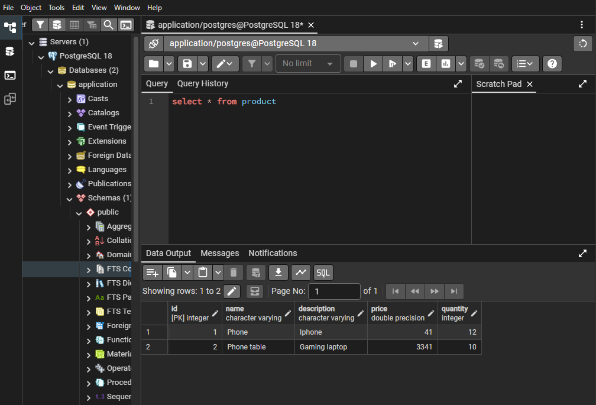

# 📦 Product Inventory Tracker

A full-stack inventory management application built with React, FastAPI and PostgreSQL.

The application allows users to add, edit, delete and search products while tracking their price and quantity.

The frontend UI was generated with the help of AI, while the backend, API logic and database integration were implemented manually.

## Features

- Add products
- Edit products
- Delete products
- Search products
- Track price and quantity
- PostgreSQL database storage

## Built with

- Python
- FastAPI
- SQLAlchemy
- PostgreSQL
- pgAdmin 4
- React
- JavaScript

## Screenshots

### Application

### PostgreSQL Database

